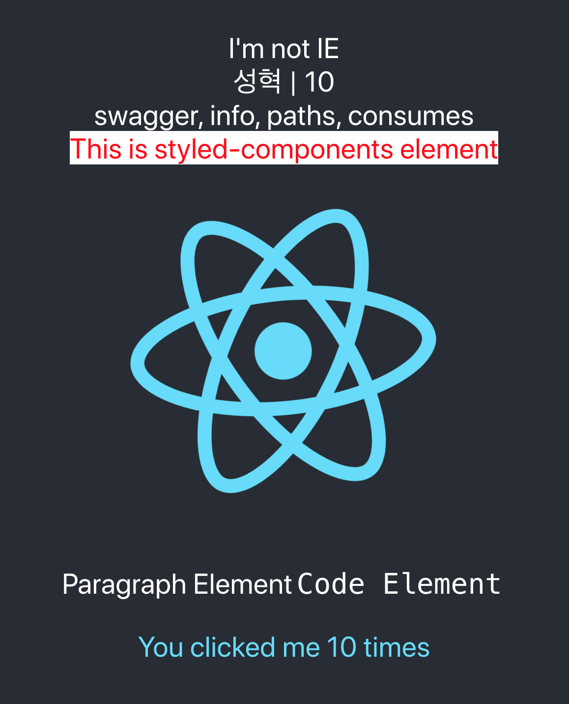
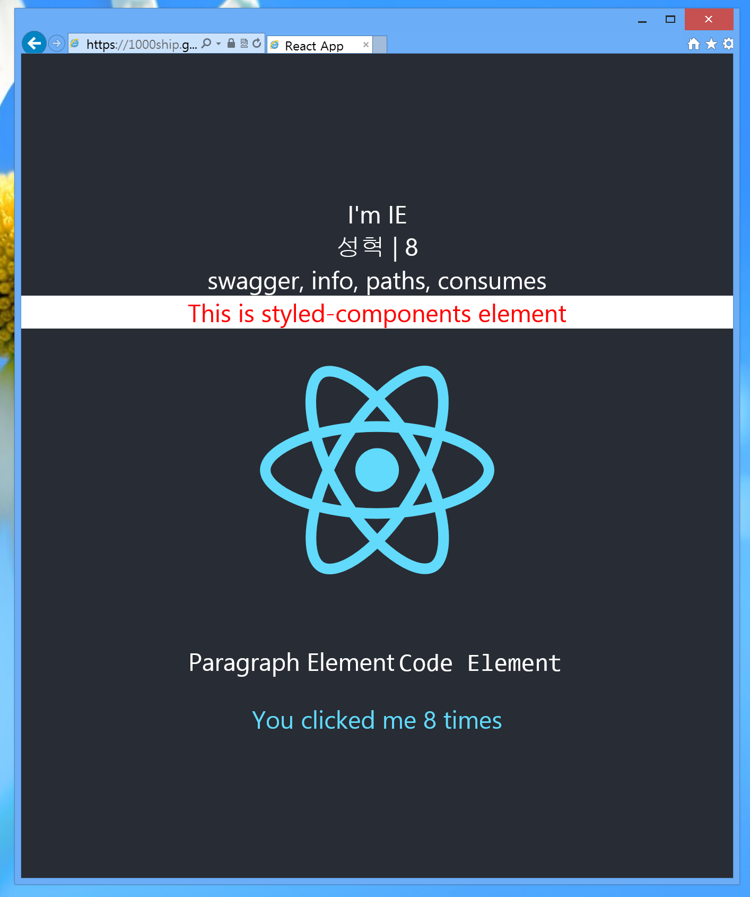

# Let's check how many features works in IE

## 

| Not IE                                       | IE                                       |
| -------------------------------------------- | ---------------------------------------- |
|  |  |


## Memo

- Only production mode supports IE browser

  ` "start:ie": "nodemon --watch 'src/**/*' -e ts,tsx,css --exec 'yarn build && serve -s build'"`

- Recognize IE browser

  ` export const isIE = /* @cc_on!@ */ false || !!(document as any).documentMode;`

- Check out at this page

  - Main Page : http://1000ship.github.io/react-polyfill-test
  - Another Page : http://1000ship.github.io/react-polyfill-test/#/another


## JS

- async-await / Promise (OK)
- useState (OK)
- useEffect (OK)
- useRef (OK)
- useCallback (OK)
- useContext (OK)
- fetch (OK)


## CSS

- flexbox (NO)

  ```css
  .like_flexbox {
    display: table-cell;
    text-align: center;
    vertical-align: middle;
  }
  ```

  

- animation (NO)

- Unit 'vw', 'vh' (OK)

- cursor (OK)

- @media query (OK)


## Module

- styled-components (OK)


## Other

- import SVG file (OK)
- Typescript (OK)
- react-router-dom (OK)
  (Don't put 'homepage' attribute in package.json)